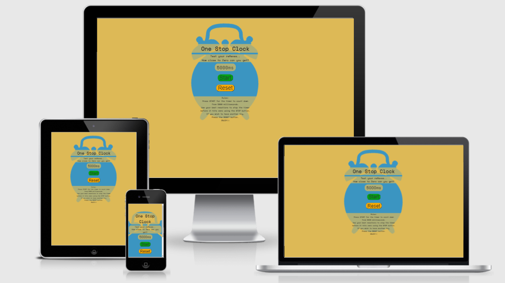

# PORTFOLIO PROJECT - 2

# ONE STOP CLOCK

## PURPOSE

'One Stop Clock' is a game where your reaction timing is key. Test your reactions by trying to get the timer as close to zero as possible with the use of the three buttons, Start, Stop and Reset.
* [Here is a link to the final project](https://chr15w1986.github.io/Javascript_PP2/)
## FINAL DESIGN

## INITIAL IDEA CONCEPT

My initial idea for the project was to create a game that is simple to use and competitive. The game is for all ages and skill levels.
I chose to make the game quite bright and fun looking with yellows and blues.
I made the game for Mobile first so that is works on all screen sizes.

* The Features I wanted the game to have are:

    * To have simple to read rules.
    * Have a contrasting colour scheme (Light blue and Yellow with Dark-Grey text)
    * Have a simple layout with 3 clear buttons with corresponding colours 
    * Look fun with images, and be educational
#  
## CONTENTS

- [PORTFOLIO PROJECT - 2](#portfolio-project---2)
- [ONE STOP CLOCK](#one-stop-clock)
  - [PURPOSE](#purpose)
  - [FINAL DESIGN](#final-design)
  - [INITIAL IDEA CONCEPT](#initial-idea-concept)
- 
  - [CONTENTS](#contents)
- [UX/UI](#uxui)
  - [USER STORIES](#user-stories)
  - [WIREFRAMES](#wireframes)
  - [FEATURES](#features)
  - [DESIGN](#design)
- 
- [TESTING](#testing)
  - [DEVICES](#devices)
  - [Validators](#validators)
  - [Lighthouse](#lighthouse)
  - [Game](#game)
  - [Accessibility](#accessibility)
  - [SOLVED BUGS AND ERRORS](#solved-bugs-and-errors)
  - [UNSOLVED BUGS OR ERRORS](#unsolved-bugs-or-errors)
  - [FUNCTIONALITY](#functionality)
- [TECHNOLOGIES USED](#technologies-used)
  - [PROGRAMS USED](#programs-used)
- [DEPLOYMENT](#deployment)
  - [REMOTE DEPLOYMENT:](#remote-deployment)
  - [HOW TO FORK A REPOSITORY:](#how-to-fork-a-repository)
  - [HOW TO CLONE A REPOSITORY:](#how-to-clone-a-repository)
  - [HOW TO MAKE A LOCAL CLONE](#how-to-make-a-local-clone)
  - [CREDITS AND REFERENCES](#credits-and-references)
    - [IMAGES AND INFORMATION](#images-and-information)
    - [CODE](#code)
  - [ACKNOWLEDGEMENTS:](#acknowledgements)
      - [RETURN TO THE TOP](#return-to-the-top)

- [CREDITS](#credits-and-references)
  * [IMAGES AND INFORMATION](#images-and-information)
  * [CODE](#code)
- [ACKNOWLEDGEMENTS](#acknowledgements)

#
# UX/UI
* The game was created to show my knowledge of JAVASCRIPT including, HTML and CSS
* To provide users with a game that is easy to play and fun
* The game should be simple play
* Any interactive buttons should clear and obvious as to what they do

Site Goals:

* To showcase my skills in JAVASCRIPT, HTML and CSS
* To provide users with an easy to play game
* To provide users with rules on how to play the game
* To make the game easily accessible

## USER STORIES

* As a user, I want to easily understand the main purpose of the game
* As a user, I want the game to be colourful and fun
* As a user, I want to be able to try something new
* As a user, I want to see large buttons to play the game

## WIREFRAMES

* Wireframes for mobile and desktop can be viewed [here](assets/wireframes/wireframes.pdf)

## FEATURES

* The Game consists of: 
    * One page with three large buttons and a timer
    * A heading of One Stop Clock
    * An introduction of what the game is
    * Rules (How to play) at the bottom of the screen
  
* Layout and content:
    * The layout is simple and stays centered across all screen widths
    * The text and heading are top and bottom to keep the main game area in the centre
## DESIGN
* Color Scheme:
    * For the game I chose light and bright colours to keep it fun looking
    * The color scheme chosen were Light yellow and Blue, With Dark Grey text rgb(32, 30, 30)
    * The background image will be Light Blue in the shape of a clock rgb(63,72,204)
    * The background colour is light yellow rgb(221,185,86)
  

* IMAGES
    * There is one background image, a silouhette of a clock.
    * The image has been compressed through `Tinypng.com`
    * The image used has not been pushed past the pixel limit in order to prevent image distortion

* TYPOGRAPHY
    * The fonts used for my website is "Raleway" and "Space-mono". The font is imported from Google Fonts

# 

# TESTING

* `As a user, I want to easily understand the main purpose of the game`:
    * Upon loading the Game, you will see a large blue clock on a yellow background, with three buttons, START, STOP AND RESET and the rules of the game. `Fulfilled.`
* `As a user, I want the game to be colourful and fun`:
    *  I used bright colours, simple traffic light colours for stop start and reset. `Fulfilled.`
* `As a user, I want to be able to try something new`:
    * The concept of the game (although simple) is exciting and different, enough to keep the user trying over and over to reach the best score he/she them/they can. `Fulfilled.`
* `As a user, I want to see large buttons to play the game`:
    * I included three large and easy to read buttons with accompanying colours to differentiate between them. `Fulfilled.`
## DEVICES
* I have tested responsiveness and functionality on the following devices and browsers:
    * Android:
      * Samsung S20 FE
      * Samsung S10
      * Samsung Galaxy Tab A
    * Apple:
      * Iphone 6s
      * Iphone 8
      * Iphone 11
    * Desktops/laptops:
      * Dell XPS15 9570 Laptop
      * HP Pavillion Laptop
    * Browsers:
      * Chrome
      * Edge
      * Firefox
      * Safari
## Validators

* I ran all of my code through css-validator and html-validator, No errors found
* I ran all of my Javascript code through JSHint, No errors found
* See [HERE](assets/testing/JSHint.png) for JSHint Report
* See [HERE](https://jigsaw.w3.org/css-validator/validator?uri=https%3A%2F%2Fchr15w1986.github.io%2FJavascript_PP2%2F&profile=css3svg&usermedium=all&warning=1&vextwarning=&lang=en) for the ONE STOP CLOCK report on CSS Validator
* See [HERE](https://validator.w3.org/nu/?doc=https%3A%2F%2Fchr15w1986.github.io%2FJavascript_PP2%2F) for the ONE STOP CLOCK report on HTML Validator
## Lighthouse

* I ran the game live through Chrome Lighthouse and received the following results with an average of 98% for Performance, Accessibility and Best practices.

## Game

## Accessibility

* The game has been run through wave.webaim.org for accessibility testing.
    * Found here: [Full Report](https://wave.webaim.org/report#/https://chr15w1986.github.io/Javascript_PP2/)
## SOLVED BUGS AND ERRORS

* I noticed a bug on each page that was identified as a lack of `max-width` on the `body` element, I have since set this to `1920px`
* Youtube videos on the home page would overlap at screen widths smaller than `650px`. This was cured with the use of `position:relative` and `position:absolute`
* The `navbar` would always "hang" to the left until media queries kicked in at 440px, at which point the would centre align and stack. This was cured by the use of `display:grid`. Now they are inline, centred and responsive
* Once the form on the contact page was filled in and the `GO!` button pressed, I wanted the next page to be a `Thankyou for contacting us` page. This didnt seem to work. The `form method="POST"` attribute that I was using seem to be the culprit, This has now been changed to `form method="GET"` and it now works fine
* On the `Thankyou for contacting us` page, the `Return to Home` button didnt work the way I wanted it to, this was solved by wrapping the `input` element in a `form` element and giving the form a `method="GET"`
* The four images on the main page were unresponsive, they either stacked or overlapped at any screen size below around 800px. This was sorted by setting up a `grid`. This then gave me the control to move the images where I wanted them at multiple screen widths
* Any duplicate or unused selectors, classes, id's and elements have been removed
* Any irrelevant space in between code has been removed
* On Apple Safari Browser and Samsung Internet the `HERE` link appeared black or darker, but stayed white on chrome. Solved the issue on Safari by targeting the link directly and setting the colour to an off shade of white `#d6d4d4` rather than `inherit` to keep consistency throughout the page. This issue still exists on Samsung internet. The cause is `light-mode` and `dark-mode` settings on samsung phones which inverts colours, and not the code itself
## UNSOLVED BUGS OR ERRORS
* The navbar `contact` link overflows as the screen gets below 270px wide
* The `central images` on the home screen overflow on the right side of the screen below 270px wide
* The two `Youtube videos` overflow (stop being responsive) when the screen width is below 270px wide
## FUNCTIONALITY
* All links have been hovered over and clicked on to ensure accessibility
* Pages all load correctly on all device screen sizes
* All Social media links work correctly and open on a new tab
* All images load on each page as intended
#
# TECHNOLOGIES USED

* [HTML](https://en.wikipedia.org/wiki/HTML5)
* [CSS](https://en.wikipedia.org/wiki/CSS#CSS_3)
## PROGRAMS USED

* GIT
  * For version control, commiting and pushing to github
* GITPOD
  * The IDE used to code this website
* GITHUB
  * Used to store repositories, files and images pushed from gitpod
* Am I Responsive
  * Used to test responsiveness of the website at different screen sizes
* CHROME Developer tools
  * For checking compatibilty, troubleshooting and editing code
* FONTAWESOME
  * Used for the social media links in the footer of each page
#
# DEPLOYMENT
## REMOTE DEPLOYMENT:
(Assuming you have already cloned or forked,)
* This site was deployed using GitHub Pages with the following the steps:

1. Click on the `Settings` icon at the top of page in the navigation bar
2. Scroll down until you see `Github Pages`
3. There will be a message box saying "Check it out here" Click on the link to take you to the next page
4. Here you will be greated with a form, Choose the repository `Project-1`
5. Choose the branch in the drop down box, in this case `MAIN`
6. Choose the directory in the next drop down box, in this case `Root`
7. Then click `Save`
8. It may take a few moments for the site to publish, but once live, the box at the top of the page with the site name will turn green and have a `Green` tick to the left of the link to the live site
9. Another way to find the live site is to navigate to settings, on the left menu click on `pages` and this will get you to the same point.

* These commands were used for version control during project:

    * git add `example filename` - to add files before committing
    * git commit -m `"example message"` - to commit changes to the local repository
    * git push - to push all committed changes to the GitHub repository
## HOW TO FORK A REPOSITORY:

If you need to "FORK" a repository:

1. If you have not already, login in to [GitHub](www.github.com) and go to https://github.com/Chr15w1986/Portfolio-1
2. In the top right corner, click `Fork`
3. The next page will be the forked version of https://github.com/Chr15w1986/Portfolio-1 but in your own repository
## HOW TO CLONE A REPOSITORY:

If you need to make a clone of this repository:

1. Fork the repository https://github.com/Chr15w1986/Portfolio-1 using the steps above
2. Above the file list, click `Code` (Usually green at the top right of the code window)
3. Choose if you want to clone using HTTPS, SSH or GitHub CLI, then click the copy button to the right
4. Open Git Bash
5. Change the directory to where you want your clone to go (your own github)
6. Type `git clone` and then paste the URL you copied in step 4
7. Press `Enter` to create your clone

## HOW TO MAKE A LOCAL CLONE

If you need to make a local clone:

1. If you have not already, login in to [GitHub](www.github.com) and go to https://github.com/Chr15w1986/Portfolio-1
2. Under the repository name, above the list of files, click `Code`
3. Here you will have two options, `Clone` or `Download` the repository
4. You should close the repository using HTTPS, clicking on the icon to copy the link
5. At this point, you can launch the `Gitpod workspace` or choose your own directory
5. Open Git Bash
6. Change the current working directory to the new location of where you want the cloned directory to be
7. Type git clone and then paste the URL you copied in step 4
8. Press Enter, to create your local clone to your chosen directory

#
## CREDITS AND REFERENCES

### IMAGES AND INFORMATION

* [Inspired Bicycles](Inspiredbicycles.com) for some of the images. [Found here](testing/image-links.txt)
* [Tribalzine](Tribalzine.com) and [Valdisolebikeland](valdisolebikeland.com) for the Rules images. [Found here](testing/image-links.txt)
* [Wikipedia](https://en.wikipedia.org/wiki/Mountain_bike_trials) for [UCI](https://www.uci.org/) and [BIU](https://biketrial.site/) Images and information.
* Background image and Gallery images were from multiple sources. [Found here](testing/image-links2.txt)
* [UCI](https://www.uci.org/) and [BIU](https://biketrial.site/) Association for the use of rules on the sport of trials riding

### CODE

* Kevin Powell on [Youtube](https://www.youtube.com/) for CSS tutorials on GRID and FLEXBOX
* Responsive Design course on [Youtube](https://www.youtube.com/) for responsive code in CSS
* Everybody on slack for pointing me to [W3Schools](https://www.w3schools.com/) for more indepth guides to the uses of HTML and CSS
#
## ACKNOWLEDGEMENTS:

- Code institute for the Tutors on the course.
- My Mentor [Chris Quinn](https://github.com/10xOXR) For pushing me to be different in my code.
- Matt Bodden, for taking time out of his own studies to give his expert help and guidance with perfecting CSS.
- My family for their support and patience.
- Everybody on Slack for tips, advice, quick fixes and kind words.

#### RETURN TO THE [TOP](#trials-world)