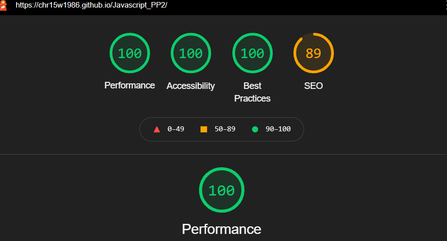
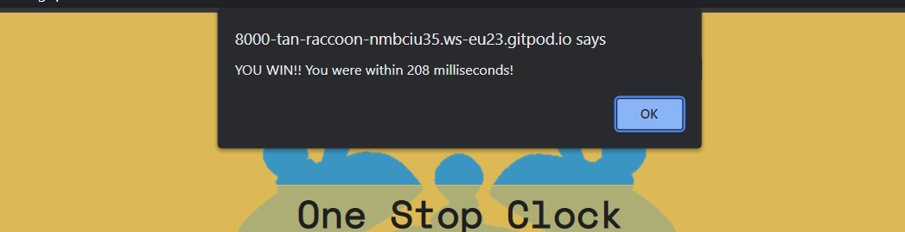

# PORTFOLIO PROJECT - 2

# ONE STOP CLOCK

## PURPOSE

'One Stop Clock' is a game where your reaction timing is key. Test your reactions by trying to get the timer as close to zero as possible with the use of the three buttons, Start, Stop and Reset.
* Here is a link to the [final project](https://chr15w1986.github.io/Javascript_PP2/)
## FINAL DESIGN

## INITIAL IDEA CONCEPT

My initial idea for the project was to create a game that is simple to use and competitive. The game is for all ages and skill levels.
I chose to make the game quite bright and fun looking with yellows and blues.
I made the game for Mobile first so that is works on all screen sizes.

* The Features I wanted the game to have are:

    * To have simple to read rules.
    * Have a contrasting colour scheme (Light blue and Yellow with Dark-Grey text)
    * Have a simple layout with 2 clear buttons with corresponding colours
#  
## CONTENTS

- [UX/UI](#uxui)
  - [USER STORIES](#user-stories)
  - [WIREFRAMES](#wireframes)
  - [FEATURES](#features)
  - [DESIGN](#design)
- [TESTING](#testing)
  - [DEVICES](#devices)
  - [Validators](#validators)
  - [Lighthouse](#lighthouse)
  - [Game](#game)
  - [Accessibility](#accessibility)
  - [SOLVED BUGS AND ERRORS](#solved-bugs-and-errors)
  - [UNSOLVED BUGS OR ERRORS](#unsolved-bugs-or-errors)
  - [FUNCTIONALITY](#functionality)
- [TECHNOLOGIES USED](#technologies-used)
  - [PROGRAMS USED](#programs-used)
- [DEPLOYMENT](#deployment)
  - [REMOTE DEPLOYMENT:](#remote-deployment)
  - [HOW TO CREATE A BRANCH/TAG OF MAIN:](#how-to-create-a-branchtag-of-main)
  - [HOW TO FORK A REPOSITORY:](#how-to-fork-a-repository)
  - [HOW TO CLONE A REPOSITORY:](#how-to-clone-a-repository)
  - [HOW TO MAKE A LOCAL CLONE](#how-to-make-a-local-clone)
  - [CREDITS AND REFERENCES](#credits-and-references)
    - [IMAGE](#image)
    - [CODE](#code)
  - [ACKNOWLEDGEMENTS:](#acknowledgements)
      - [RETURN TO THE TOP](#return-to-the-top)

- [CREDITS](#credits-and-references)
  * [IMAGES AND INFORMATION](#images-and-information)
  * [CODE](#code)
- [ACKNOWLEDGEMENTS](#acknowledgements)

#
# UX/UI
* The game was created to show my knowledge of JAVASCRIPT including, HTML and CSS
* To provide users with a game that is easy to play and fun
* The user is able to interact with 2/3 clear buttons to play the game
* Any interactive buttons should clear and obvious as to what they do

Site Goals:

* To showcase my skills in JAVASCRIPT, HTML and CSS
* To provide users with an easy to play game
* To provide users with rules on how to play the game
* To make the game easily accessible

## USER STORIES

* As a user, I want to easily understand the main purpose of the game
* As a user, I want the game to be colourful and fun
* As a user, I want to be able to try something new
* As a user, I want to see obvious and clear buttons to play the game

## WIREFRAMES

* Wireframes for mobile and desktop can be viewed [here](assets/wireframes/wireframes.pdf) (pdf)

## FEATURES

* The Game consists of: 
    * One page with two large buttons and a timer
    * The Start button, once clicked, changes to Stop for to provide a user friendly experience 
    * A heading of One Stop Clock
    * An introduction of what the game consists of
    * Rules (How to play) at the bottom of the screen

* Future features:
    * I would add a highest score `Scoreboard` for competitions
    * Add an option for the user to set their own timer `Value`
    * Add an option for the user to set different difficulty levels, 
        * I.e The speed the timer reduces by,
        * The timer becomes easier or harder to see by adjusting the transparency level,
        * An option to stop the timer at a randomly set time rather than zero
  
* Layout and content:
    * The layout is simple and stays centered across all screen widths
    * The text and heading are top and bottom to keep the main game area in the centre

* Color Scheme:
    * For the game I chose light and bright colours to keep it fun looking
    * The color scheme chosen were Light yellow and Blue, With Dark Grey text rgb(32, 30, 30)
    * The background image will be Light Blue in the shape of a clock rgb(63,72,204)
    * The background colour is light yellow rgb(221,185,86)
    * The button colours are a traffic light system with Red (STOP), Green (START) and Amber/Orange (RESET)
  

 

* IMAGES
    * There is one background image, a silhouette of a clock.
    * The image has been compressed through `Tinypng.com`
    * The image used has not been pushed past the pixel limit in order to prevent image distortion

* TYPOGRAPHY
    * The fonts used for my website is "Raleway" and "Space-mono". The font is imported from Google Fonts

# 

# TESTING

* `As a user, I want to easily understand the main purpose of the game`:
    * Upon loading the Game, you will see a large blue clock on a yellow background, with three buttons, START, STOP AND RESET and the rules of the game. Outcome: `Fulfilled.`
* `As a user, I want the game to be colourful and fun`:
    *  I used bright colours, simple traffic light colours for stop start and reset. Outcome: `Fulfilled.`
* `As a user, I want to be able to try something new`:
    * The concept of the game (although simple) is exciting and different, enough to keep the user trying over and over to reach the best score he/she them/they can. `Fulfilled.`
* `As a user, I want to see obvious and clear buttons to play the game`:
    * I included two large and easy to read buttons with accompanying colours to differentiate between them. Outcome: `Fulfilled.`
## DEVICES
* I have tested responsiveness and functionality on the following devices and browsers:
    * Android:
      * Samsung S20 FE
      * Samsung S10
      * Samsung Galaxy Tab A
    * Apple:
      * Iphone 6s
      * Iphone 8
      * Iphone 11
    * Desktops/laptops:
      * Dell XPS15 9570 Laptop
      * HP Pavillion Laptop
    * Browsers:
      * Chrome
      * Edge
      * Firefox
      * Safari
* The game functions as intended on all viewports.
## Validation

* I ran all of my code through [css-validator](https://jigsaw.w3.org/css-validator/) and [html-validator](https://validator.w3.org/#validate_by_input)
    * See [HERE](https://jigsaw.w3.org/css-validator/validator?uri=https%3A%2F%2Fchr15w1986.github.io%2FJavascript_PP2%2F&profile=css3svg&usermedium=all&warning=1&vextwarning=&lang=en) for the ONE STOP CLOCK report on CSS Validator
    * See [HERE](https://validator.w3.org/nu/?doc=https%3A%2F%2Fchr15w1986.github.io%2FJavascript_PP2%2F) for the ONE STOP CLOCK report on HTML Validator
* I ran all of my Javascript code through JSHint, No errors found
    * See [HERE](assets/testing/JSHint.png) for JSHint Report

## Lighthouse

* I ran the game live through Chrome Lighthouse and received the following results with an average of 98% for Performance, Accessibility and Best practices.

## Accessibility

* The game has been run through wave.webaim.org for accessibility testing.
    * Found here: [Full Report](https://wave.webaim.org/report#/https://chr15w1986.github.io/Javascript_PP2/)
## SOLVED BUGS AND ERRORS

* A bug was found when the start button was pressed and then pressed again, it would multiply the countdown speed by two and continue counting down past 0ms infinitely. 
    * This was cured by adding a `hidden` class to the buttons in HTML, so that once the start button is pressed, it switches to the stop button, meaning the start button cannot physically be pressed again until the game is reset.
* The timer itself wouldnt show upon loading the page until the start button had been pressed and the timer started counting down.
    * This was cured by adding a global variable of `const timer = 5000;` to ensure the timer is visible once the page loaded.
* There was an issue with setInterval, with some research I came to realise the minimum DOM handling was no lower than 4ms per interval for HTML5. 
    * I cured this by creating a variable of throttleAmount and setting it to 4ms.
* Any duplicate or unused selectors, classes, id's and elements have been removed
* Any irrelevant space in between code has been removed

## UNSOLVED BUGS OR ERRORS

* The stop button, although it stopped the timer, if the start button was then pressed again, the timer would deduct 4ms and then count past the 0ms into minus figures. 
    * This was actually due to the `throttleAmount` loop being re-run at the interval of 4ms. 
        - The error still exists, but, it is such a small amount of time (4 milliseconds) that it is hardly noticeable to the user.
## FUNCTIONALITY
* All buttons have been clicked on to ensure correct function
* The game loads correctly on all device screen sizes
* The image loads on the background as intended on all screen sizes

### Feedback
* The user will experience feedback in the form of an alert box with how many milliseconds they won or lost by.

#
# TECHNOLOGIES

## DEVELOPMENT

* The project was written and tested using [Vscode](https://code.visualstudio.com/)
* The project uses [Github](https://github.com/) for utilising git version control
* The project was debugged using [Google Chrome Development tools](https://developer.chrome.com/docs/devtools/)

## DESIGN

* The project's wireframes were designed in [Balsamiq](https://balsamiq.com/wireframes/)
* The project utilised [favicon.io](https://favicon.io/favicon-converter/) to create the Favicon to the appropriate format
* The background image was compressed using [TinyPNG](https://tinypng.com/)

## LANGUAGES USED

* The project was written using [HTML5](https://en.wikipedia.org/wiki/HTML5) for the basic structure
* The project was written using [CSS3](https://en.wikipedia.org/wiki/CSS#CSS_3) for styling
* the project was written using [JAVASCRIPT ES6](https://en.wikipedia.org/wiki/JavaScript) for HTML manipulation
## PROGRAMS USED

* GIT
  * For version control, commiting and pushing to github
* GITPOD
  * The IDE used to code the game
* GITHUB
  * Used to store repositories, files and images pushed from gitpod
* Am I Responsive
  * Used to test responsiveness of the game at different screen sizes
* CHROME Developer tools
  * For checking compatibilty, troubleshooting and editing code
* With more time I would have used frameworks such as [Jasmine](https://jasmine.github.io/pages/getting_started.html) for testing 
#
# DEPLOYMENT
## REMOTE DEPLOYMENT:
(Assuming you have already cloned or forked,)
* This Game was deployed using GitHub Pages with the following the steps:

1. Click on the `Settings` icon at the top of page in the navigation bar
2. Scroll down until you see `Github Pages`
3. There will be a message box saying "Check it out here" Click on the link to take you to the next page
4. Here you will be greated with a form, Choose the repository `Javascript_PP2`
5. Choose the branch in the drop down box, in this case `MAIN`
6. Choose the directory in the next drop down box, in this case `Root`
7. Then click `Save`
8. It may take a few moments for the game to publish, but once live, the box at the top of the page with the site name will turn green and have a `Green` tick to the left of the link to the live page
9. Another way to find the live page is to navigate to settings, on the left menu click on `pages` and this will get you to the same point.

* These commands were used for version control during project:

    * git add `example filename` - to add files before committing
    * git commit -m `"example message"` - to commit changes to the local repository
    * git push - to push all committed changes to the GitHub repository
    * git branch - to see which branch currently working on
    * git pull - to pull all code into main branch once the feature branch had been merged and deleted

## HOW TO CREATE A BRANCH/TAG OF MAIN:

If you need to "BRANCH" off of the main repository:

1. If you have not already, login in to [GitHub](www.github.com) and go to https://github.com/Chr15w1986/Javascript_PP2
2. On the left side of the screen underneath the nav links, click the drop down box `Main`
3. Inside the box you will see `Create new branch/tag`
4. Inside the text box, enter the new branch or tag name i.e `Features`
5. Below the Branches Tags tab, you will see `Create branch: Features from "main"`
6. Click on `Create branch: Features from "main"` and you will be taken to the new branch page you just called `Features`

## HOW TO FORK A REPOSITORY:

If you need to "FORK" a repository:

1. If you have not already, login in to [GitHub](www.github.com) and go to https://github.com/Chr15w1986/Javascript_PP2
2. In the top right corner, click `Fork`
3. The next page will be the forked version of https://github.com/Chr15w1986/Javascript_PP2 but in your own repository
## HOW TO CLONE A REPOSITORY:

If you need to make a clone of this repository:

1. Fork the repository https://github.com/Chr15w1986/Javascript_PP2 using the steps above
2. Above the file list, click `Code` (Usually green at the top right of the code window)
3. Choose if you want to clone using HTTPS, SSH or GitHub CLI, then click the copy button to the right
4. Open Git Bash
5. Change the directory to where you want your clone to go (your own github)
6. Type `git clone` and then paste the URL you copied in step 4
7. Press `Enter` to create your clone

## HOW TO MAKE A LOCAL CLONE

If you need to make a local clone:

1. If you have not already, login in to [GitHub](www.github.com) and go to https://github.com/Chr15w1986/Javascript_PP2
2. Under the repository name, above the list of files, click `Code`
3. Here you will have two options, `Clone` or `Download` the repository
4. You should close the repository using HTTPS, clicking on the icon to copy the link
5. At this point, you can launch the `Gitpod workspace` or choose your own directory
5. Open Git Bash
6. Change the current working directory to the new location of where you want the cloned directory to be
7. Type git clone and then paste the URL you copied in step 4
8. Press Enter, to create your local clone to your chosen directory

#
## CREDITS AND REFERENCES

### IMAGE

* Background image, Silhouette of a Clock was taken from [Pixabay](https://pixabay.com/fi/illustrations/her%c3%a4tyskello-siluetti-kello-musta-2806057/)

### CODE

* [Stackoverflow](https://stackoverflow.com/questions/9647215/what-is-minimum-millisecond-value-of-settimeout) For milliseconds throttle amount code
* [OSTraining](https://www.ostraining.com/blog/coding/stopwatch/) On how to create a stopwatch in javascript
* Everybody on slack for pointing me to [W3Schools](https://www.w3schools.com/) for more indepth guides to the correct syntax and uses of Functions in JAVASCRIPT.
#
## ACKNOWLEDGEMENTS:

- Code institute for the Tutors on the course.
- My Mentor [Ben Kavanagh](https://github.com/BAK2K3) for his brilliant advice on my code, whether my code is right or wrong, his excellent way with words and constantly believing in me.
- Dave Horrocks, for taking time out of his own studies, for his excellent teaching style and expertise on all things javascript.
- My family for their support and patience.
- Everybody on Slack for tips, advice, quick fixes and kind words.

#### RETURN TO THE [TOP](#one-stop-clock)